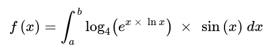
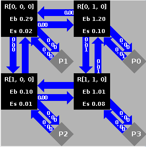
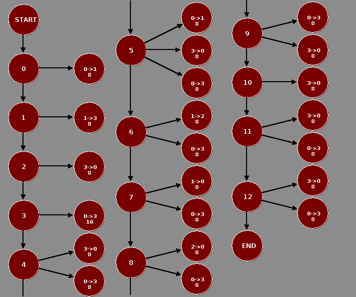
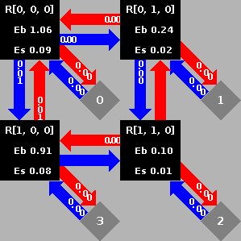
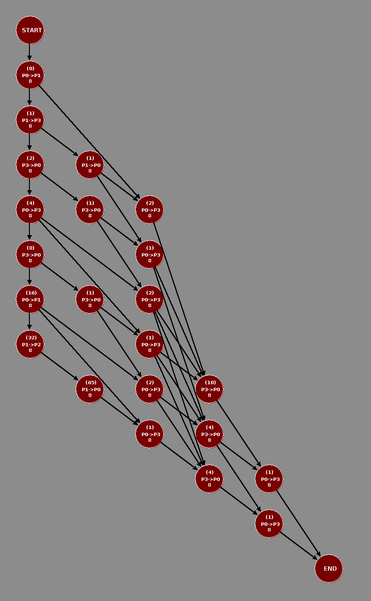
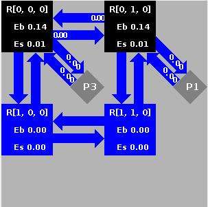
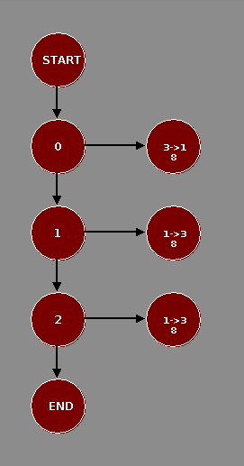
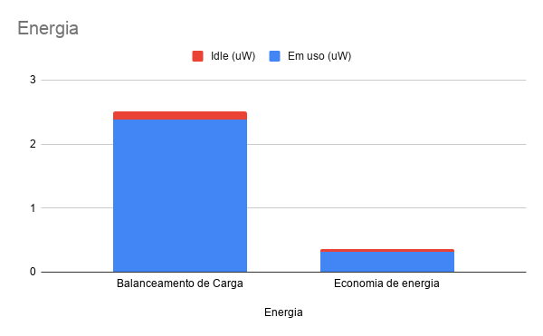
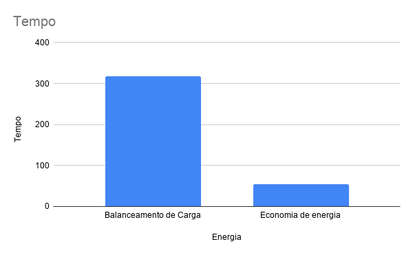

# Integração por Romberg como aplicação paralela em MPSoC
Angelo Elias Dalzotto

Disciplina de Modelagem Computacional para Sistemas Embarcados

Prof. Dr. César Augusto Missio Marcon

## A Integração por Romberg
A método Romberg é um processo iterativo de integração que visa diminuir o erro da regra dos trapézios composta sem adicionar muita complexidade computacional.

Os passos para aplicar a integração consistem em resolver a regra dos trapézios composta para `n=1`, onde `n` é o número de trapézios que terão a sua área cálculada para estimar a integral. Variando o número de trapézios, seguindo `n=2^i` onde `i` é a iteração, se obtém menor erro, sendo necessário calcular somente os trapézios intermediários adicionais a cada iteração. Com o método de Romberg é possível combinar o resultado da aplicação da regra dos trapézios composta para reduzir ainda mais o erro com pouco esforço computacional realizando médias ponderadas dos valores.

## Objetivos

O objetivo desse relatório é apresentar uma aplicação de Romberg implementada sequencialmente, então idealizada para implementação paralela. Em seguida, é descrito como foi solucionado esse problema paralelamente, modelando a aplicação de forma a encontrar o particionamento ideal das tarefas e o mapeamento ótimo dos processadores.

A equação usada como base para a integração é



## Implementação em C++ sequencial
Uma implementação sequencial foi desenvolvida para aplicar o método de Romberg usando a linguagem C++. A função 
```
double romberg(double (*f)(double), double a, double b, uint64_t sweeps, bool verbose);
```
aplica o método de Romberg para uma função passada por ponteiro
```
double f(double x);
```
onde `x` é a variável independente da função matemática. Os intervalos de integração são definidos pelos limites `a` e `b`. O número de iterações é definido por `sweeps`.

Antes de executar o método, cria-se uma estrutura de fila para armazenar os valores aguardando a aplicação do método de Romberg:
```
std::queue<double> ctrs;
```

Também calculam-se os valores que permanecerão iguais para todas iterações. São eles: a) `interval`, o tamanho do intervalo de integração; b) `limit_sum`, a soma do resultado da aplicação da função para os limites de integração.
```
static double interval = b - a;
static double limit_sum = f(a) + f(b);
```

A cada iteração `i` são calculados o número de trapézios `n` e o tamanho `h` de cada um deles:
```
uint64_t n = 1 << i;
double h = interval / static_cast<double>(n);
```
Como cada iteração dobra o número de trapézios, só é necessário calcular os de índice ímpar, pois os índices pares já estarão todos calculados pelas iterações anteriores:
```
static double trapezoids = 0;
for(uint64_t k = 1; k < n; k += 2)
	trapezoids += f(a + k*h);
```

Por fim, aplica-se a regra dos trapézios composta e guarda o resultado na fila:
```
double ctr = h/2.0 * (limit_sum + 2.0 * trapezoids);
ctrs.push(ctr);
```

Para todas as iterações após a primeira é aplicado o método de Romberg para o número de dados aguardando na fila. Cada elemento calculado é adicionado à fila e o elemento que foi usado de base para o cálculo é removido.
```
for(uint64_t r = 1; r <= i; r++){
	double weight = pow(4, r);
	double romberg = (weight * ctr - ctrs.front()) / (weight - 1);

	ctrs.pop();
	ctrs.push(romberg);
	ctr = romberg;
}
```

Por fim, quando o valor de `i` atinge o número de iterações desejadas, é retornado o último valor adicionado à fila, que coincide com a maior profundidade do método de Romberg executado.

```
return ctrs.back();
```

É possível escolher o intervalo de integração definido pelos limites `A` e `B` e o número de iterações `SWEEPS` a partir de argumentos passados pela linha de comando. Adicionalmente é possível imprimir a tabela da integração de Romberg com a opção `--verbose`:
```
$ romberg-seq A B SWEEPS [--verbose]
```

Para compilar a aplicação, é necessário ter o G++ com suporte a C++11 e executar:
```
$ make
```

## Arquitetura paralela idealizada
A partir da implementação sequencial, é possível perceber que o maior gargalo se encontra no cálculo dos trapézios, devido que a cada iteração o número de intervalos a ser calculado cresce em `2^i - 2^(i-1)`. Esse gargalo pode ser reduzido paralelizando a aplicação. Dessa forma, a implementação deve calcular em cada thread seus trapézios de índice ímpar, enquanto aguarda os trapézios da iteração anterior ser calculado, que resultará em seus trapézios de índice par. A partir desse momento, o valor total dos trapézios da thread deve ser enviado à próxima iteração. Então, a regra dos trapézios composta será aplicada e o seu valor será enviado para a primeira thread do método de Romberg. Cada passo de Romberg aguarda cada passo da iteração anterior, calcula e logo envia seu resultado para a próxima iteração.

## Implementação em C++ paralela
Uma implementação paralela foi desenvolvida em C++. Em primeiro lugar, criam-se os mecanismos de comunicação dos processos, definidos por um conjunto de filas `comm` e um conjunto de semáforos `sync` baseados no número de integrações ou profundidade do método de Romberg `sweeps`, por meio do construtor de `Communication`
```
Communication::Communication(uint64_t sweeps)
{
	comm.reserve(sweeps * 2 - 1);
	sync.reserve(sweeps * 2 - 1);

	for(uint64_t i = 0; i < sweeps * 2 - 1; i++){
		comm.push_back(std::queue<double>());

		sem_t s;
		sem_init(&s, 0, 0);
		sync.push_back(s);
	}
}
```
A função `Communication::send` envia `value` para `channel` e a função `Communication::receive` recebe de `channel`:
```
void Communication::send(double value, uint64_t channel)
{
	comm[channel].push(value);
	sem_post(&(sync[channel]));
}

double Communication::receive(uint64_t channel)
{
	sem_wait(&sync[channel]);
	double value = comm[channel].front();
	comm[channel].pop();
	return value;
}
```

O gerenciador da aplicação `MultiRomberg` aloca a tabela `table`  onde serão armazenados os resultados e inicia os processos de integração pela regra dos trapézios composta `CTR::run` e do método de Romberg `Romberg::run`, com os demais parâmetros, como o da função a ser integrada `f`, os limites de integração `a` e `b` e a iteração `i` de cada processo.
```
MultiRomberg::MultiRomberg(
	double (*f)(double), 
	double a, 
	double b, 
	uint64_t _sweeps
) : 
	comm(_sweeps),
	sweeps(_sweeps),
	table(nullptr)
{
	table = (double*)malloc(sizeof(double) * sweeps * sweeps);

	threads.reserve(sweeps * 2 - 1);

	for(uint64_t i = 0; i < sweeps; i++)
		threads.push_back(
			std::thread(&CTR::run, CTR(comm, f, a, b, sweeps, table), i)
		);

	for(uint64_t i = sweeps; i < sweeps * 2 - 1; i++)
		threads.push_back(
			std::thread(&Romberg::run, Romberg(comm, sweeps, table), i)
		);
}
```

Os processos de aplicação da integração pela regra dos trapézios composta calculam seu intervalo de integração `interval`, a soma da função aplicada a seus limites `limit_sum`, seu número de trapézios `n` e o tamanho de cada intervalo `h`.
```
void CTR::run(uint64_t i)
{
	double interval = b - a;
	double limit_sum = f(a) + f(b);
	uint64_t n = 1 << i; /* pow(2, i-1) */
	double h = interval / static_cast<double>(n);
```

Em seguida, é aplicado o cálculo dos trapézios para os índices ímpares:
```
	double trapezoids_odd = 0;
	for(uint64_t k = 1; k < n; k += 2)
		trapezoids_odd += f(a + k*h);
```
Então, é aguardado a soma dos trapézios de índice par (todos os trapézios calculados pela thread anterior) caso exista iteração anterior e realizado a soma do total de trapézios:
```
	double trapezoids_even = i ? comm.receive(i) : 0;
	double trapezoids = trapezoids_even + trapezoids_odd;
```
Nesse momento, a soma da área dos trapézios da iteração atual é enviada para a próxima thread (se ela existe) poder computar a sua integral.
```
	if(i < sweeps - 1)
		comm.send(trapezoids, i + 1);
```

A regra dos trapézios composta é aplicada e seu resultado é enviado para a thread da primeira profundidade do método de Romberg (se ela existe, pois no caso de profundidade igual a 1, somente é aplicado o método dos trapézios composto) e então o resultado é salvo na tabela:
```
	double ctr = h/2.0 * (limit_sum + 2.0 * trapezoids);
	if(sweeps > 1)
		comm.send(ctr, sweeps);
	
	table[i] = ctr;
}
```

O processo do método de Romberg define o peso da média ponderada `weight` e recebe o seu primeiro parâmetro de aplicação do método `r0` antes de entrar em repetição.
```
void Romberg::run(uint64_t i)
{
	double weight = pow(4, i - sweeps + 1);
	double r0 = comm.receive(i);
```
O laço aplica o método de Romberg para o número de casos possíveis para a profundidade do processo. Para isso, recebe-se o segundo parâmetro do método `r1`, aplica-se o método, envia o resultado para a próxima profundidade (se existente) e torna o segundo parâmetro no primeiro para a próxima repetição, finalmente salvando o resultado na tabela.
```
	for(uint64_t r = i - sweeps + 1; r < sweeps; r++){
		double r1 = comm.receive(i);

		double romberg = (weight * r1 - r0) / (weight - 1);
		if(i < sweeps * 2 - 2)
			comm.send(romberg, i + 1);

		r0 = r1;

		table[r*sweeps + (i - sweeps)] = romberg;
	}
}
```

É possível escolher o intervalo de integração definido pelos limites `A` e `B` e o número de iterações `SWEEPS` a partir de argumentos passados pela linha de comando. Adicionalmente é possível imprimir a tabela completa da integração de Romberg com a opção `--verbose`:
```
$ romberg-par A B SWEEPS [--verbose]
```

Para compilar a aplicação, é necessário ter o G++ com suporte a C++11 e executar:
```
$ make
```

## Descrição da aplicação para o framework Paloma
A aplicação foi idealizada para um número de integrações ou de profundidade do método de Romberg igual a 8, resultando em 8 tarefas CTR e 7 tarefas Romberg. A arquitetura alvo escolhida foi AVR de 4 processadores à 16 MHz. O tamanho da NoC é de 2x2 à 4MHz, com os restantes dos parâmetros do framework padrões.

O tamanho das tarefas foi determinado pelo tamanho da seção `.text` das classes `Romberg` e `CTR`, resultando em 462 bytes e 617 bytes respectivamente. O tamanho de dados não pôde ser definido em tempo de compilação, então estimou-se pelo número de bytes do objeto instanciado em tempo de execução, resultando em 24 bytes para `Romberg` e 48 bytes para `CTR`. Esses valores foram alcançados compilando a aplicação com o GCC 10.1.0 usando as flags `-std=c++11 -O3`. As estimativas de potência e uso de CPU foram feitas com base no número de cálculos que cada iteração realiza, tomando como base um único cálculo como 1% de uso de CPU e 0.1uW de potência.

A descrição da comunicação foi extraída a partir do código. Tarefas de CTR enviam para a próxima tarefa de CTR um valor `double` contendo a soma de seus trapézios e enviam para a primeira tarefa Romberg o valor da sua integração. As tarefas de Romberg enviam o número de médias ponderadas feitas, cada uma em `double`, para a próxima tarefa Romberg, sendo que cada tarefa seguinte realiza um cálculo a menos que a anterior. A última tarefa CTR não faz envios para nenhuma outra CTR e a última tarefa Romberg não realiza envios.

O mapeamento a partir do framewok Paloma foi gerado com as restrições de 32KiB de código e 2KiB de dados. Os demais parâmetros foram deixados como padrão.

## Caracterização das tarefas

A tabela abaixo mostra os dados extraídos para cada thread do processo de CTR. O número de trapézios representa o número em que o intervalo de integração foi dividido e separado em trapézios para ter sua área calculada:

| id | code (bytes) | data (bytes) | Número de trapézios | Power (uW) | Occupation (%) | Envios (double) |
|:--:|:------------:|:------------:|:-------------------:|:----------:|:-----------:|:---------------:|
|  0 |      617     |      48      |          0          |     0.1    |       1    |        2        |
|  1 |      617     |      48      |          1          |     0.2    |       2   |        2        |
|  2 |      617     |      48      |          2          |     0.3    |     3            |        2        |
|  3 |      617     |      48      |          4          |     0.5    |     5            |        2        |
|  4 |      617     |      48      |          8          |     0.9    |     9            |        2        |
|  5 |      617     |      48      |          16         |     1.7    |     17           |        2        |
|  6 |      617     |      48      |          32         |     3.5    |   33           |        2        |
|  7 |      617     |      48      |          64         |     6.5    |   65           |        1        |

A tabela abaixo mostra os dados extraídos para cada thread do processo de Romberg. O número de médias representa quantas vezes o método de Romberg foi aplicado em cada thread:

| id | code (bytes) | data (bytes) | Número de Médias | Power (uW) | Occupation (%) | Envios (double) |
|:--:|:------------:|:------------:|:----------------:|:----------:|:--------------:|:---------------:|
|  0 |      462     |      24      |         7        |     0.8    |   8            |        7        |
|  1 |      462     |      24      |         6        |     0.7    |   7            |        6        |
|  2 |      462     |      24      |         5        |     0.6    |   6            |        5        |
|  3 |      462     |      24      |         4        |     0.5    |   5            |        4        |
|  4 |      462     |      24      |         3        |     0.4    |   4            |        3        |
|  5 |      462     |      24      |         2        |     0.3    |   3            |        2        |
|  6 |      462     |      24      |         1        |     0.2    |   2            |        0        |

O gráfico abaixo relaciona o número de iterações com o número de cálculos e de comunicações a ser realizado pelo processo de CTR. Quanto maior o nível do CTR, mais ligado à computação ele é, dado que a comunicação permanece constante.
<p align="center">
  
</p>

O gráfico abaixo relaciona o número de iterações com o número de cálculos e de comunicações a ser realizado pelo processo de Romberg. Os dois valores permanecem iguais para todos os números de iterações, dividindo-se igualmente em computação e comunicação.
<p align="center">
  
</p>

O gráfico abaixo compara a computação entre os processos de Romberg e CTR baseado no número de iterações. CTR domina amplamente a computação, aumentando exponencialmente a cada iteração, enquanto Romberg aumenta linearmente.
<p align="center">
  
</p>

## Exploração de modelos computacionais


### Balanceamento de carga

O particionamento ótimo gerado pelo Paloma visando o balanceamento de carga usou todos os 4 processadores como esperado. A limitação para um balanceamento mais otimizado foi o uso de CPU, porque as duas tarefas de maior demanda somadas usam mais do CPU que todas as outras demais tarefas somadas. Isso é explicado pelo número de laços do CTR que aumenta exponencialmente com o número de iterações. As tarefas foram agrupadas conforme a tabela abaixo:

| P |               Tasks              | Uso de CPU (%) |
|:-:|:--------------------------------:|:--------------:|
| 0 |    {CTR0, CTR3, CTR5, R0, R4}    |       35       |
| 1 |           {CTR1, CTR6}           |       35       |
| 2 |              {CTR7}              |       65       |
| 3 | {CTR2, CTR4, R1, R2, R3, R5, R6} |       35       |

A ferramenta Cafes gerou o seguinte mapeamento de processadores conforme o algoritmo exaustivo baseado no CWM, onde P0 é o centro das comunicações e P2, o menos comunicante, fica mais afastado se considerado o roteamento XY. Esse modelo estima um consumo de energia da NoC de 2.85uJ:

<p align="center">
  
</p>

Em seguida, o ACPM abaixo foi modelado para esse particionamento de tarefas:
<p align="center">
  
</p>

Que gerou o seguinte mapeamento de processadores conforme a pesquisa exaustiva, gerando uma energia de 2.53uJ e uma energia em idle de 2.73uJ, além de um tempo de comunicação de 260. O mapeamento é na prática idêntico ao CWM, mas agora é possível se estimar mais detalhes de energia e alguma temporização:

<p align="center">
  
</p>

O modelo CDCM projetado abaixo resulta no mesmo mapeamento de processadores seguindo o algoritmo exaustivo, estima uma energia de 2.38uJ e uma energia idle de 0.13uJ e um tempo de 317. A temporização agora é mais detalhada, assim como o consumo de energia:

<p align="center">
  
</p>

### Consumo de energia

O particionamento ótimo gerado pelo Paloma visando a redução de energia resultou na alocação de dois processadores. Sua limitação foi novamente o uso de CPU, agrupando as duas tarefas que mais demandam do CPU em um processador e as demais tarefas no outro. As tarefas ficaram agrupadas conforme a tabela abaixo:

| P |                               Tasks                              | Uso de CPU (%) |
|:-:|:----------------------------------------------------------------:|:--------------:|
| 0 |                                {}                                |        0       |
| 1 |                           {CTR6, CTR7}                           |       98       |
| 2 |                                {}                                |        0       |
| 3 | {CTR0, CTR1, CTR2, CTR3, CTR4, CTR5, R0, R1, R2, R3, R4, R5, R6} |       72       |

A ferramenta Cafes gerou o seguinte mapeamento dos processadores usando o algoritmo exaustivo, resultando em um consumo de energia da NoC de 0.32uJ. Como esperado, P1 e P3 ficaram a um hop de distância:

<p align="center">
  
</p>

Modelando o ACPM abaixo, o mapeamento continua idêntico, estimando energia de 0.32uJ e energia em idle de 0.02uJ para a NoC, com tempo de comunicação de 54 segundo o algoritmo de pesquisa exaustiva

<p align="center">
  
</p>

O diagrama abaixo mostra a modelagem CDCM, resultando em energia de 0.32uJ, energia em idle de 0.04uJ e tempo de 105 a partir da pesquisa exaustiva. Como as tarefas encontram-se agrupadas em poucos processadores, o resultado exibiu pouquíssima comunicação.

<p align="center">
  
</p>

## Exploração de soluções

O gráfico abaixo compara a energia usada para a comunicação nos casos de melhor balanceamento de carga e de maior eficiência energética. Como esperado, o particionamento visando maior economia de energia realmente mostrou bons resultados em relação ao balancemento de carga.

<p align="center">
  
</p>

O gráfico abaixo compara o tempo usado para a comunicação nos casos de melhor balanceamento de carga e de maior eficiência energética. O tempo gasto em comunicação é 487% maior no particionamento para balanceamento de carga, mas isso pode não representar a realizadade, pois a escolha pelo balanceamento de carga pode melhorar a paralelização da aplicação, reduzindo drasticamente o tempo total de execução.

<p align="center">
  
  <center></center>
</p>

Uma conclusão definitiva pode ser alcançada com, por exemplo, maiores detalhes microarquiteturais dos processadores e por meio do uso de simulação, complementando a modelagem formal usada no relatório.