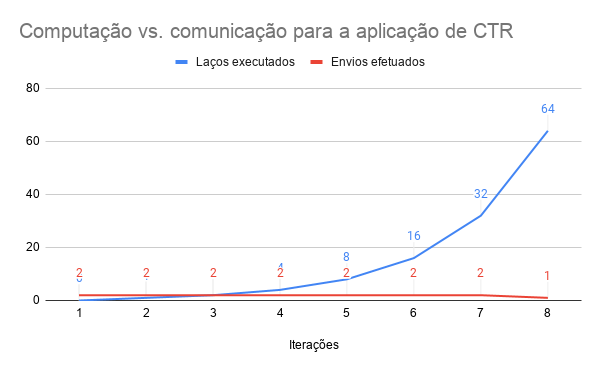
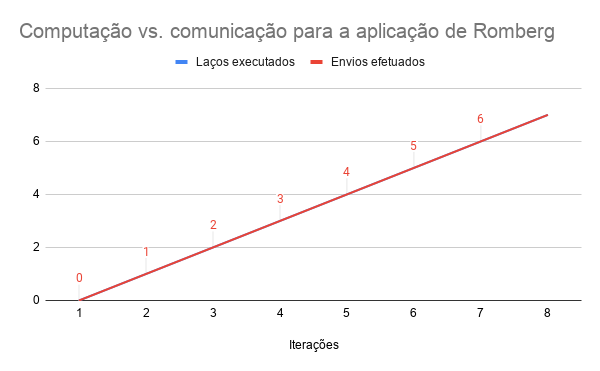
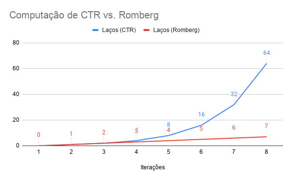

# Integração por Romberg como aplicação paralela em MPSoC
Angelo Elias Dalzotto
Disciplina de Modelagem Computacional para Sistemas Embarcados
Prof. Dr. Augusto César Marcon

## A Integração por Romberg
O método de integração por Romberg é um método iterativo que visa diminuir o erro do método dos trapézios composto sem adicionar muita complexidade computacional.

Os passos para aplicar a integração consiste em resolver o método dos trapézios compostos para `n=1`, onde `n` é o número de trapézios a ser calculada a área. Variando o número de trapézios, seguindo `n=2^i` onde `i` é a iteração, se obtém menor erro, sendo necessário calcular somente os trapézios intermediários adicionais a cada iteração. Com o método de Romberg é possível combinar o resultado da aplicação do método dos trapézios compostos para reduzir ainda mais o erro com pouco esforço computacional realizando uma média ponderada dos valores.

## Objetivos

ADICIONAR OBJETIVOS

ADICIONAR EQUAÇÃO A SER RESOLVIDA

## Implementação em C++ sequencial
Uma implementação sequencial foi desenvolvida para aplicar a integração por Romberg usando a linguagem C++. A função 
```
double romberg(double (*f)(double), double a, double b, uint64_t sweeps, bool verbose);
```
aplica o método de Romberg para uma função passada por ponteiro
```
double f(double x);
```
onde `x` é a variável independente da função matemática. Os intervalos de integração são definidos pelos limites `a` e `b`. O número de iterações é definido por `sweeps`.

Primeiro, define-se uma estrutura de fila para armazenar os valores aguardando a aplicação do método de Romberg:
```
std::queue<double> ctrs;
```

Também calculam-se os valores que permanecerão iguais para todas iterações. São eles: a) `interval`, o tamanho do intervalo de integração; b) `limit_sum`, a soma do resultado da aplicação da função para os limites de integração.
```
static double interval = b - a;
static double limit_sum = f(a) + f(b);
```

A cada iteração `i` são calculados o número de trapézios `n` e o tamanho `h` de cada um deles:
```
uint64_t n = 1 << i;
double h = interval / static_cast<double>(n);
```
Como cada iteração se dobra o número de trapézios, só é necessário calcular os de índice ímpar, pois os índices pares já estarão todos calculados pelas iterações anteriores:
```
static double trapezoids = 0;
for(uint64_t k = 1; k < n; k += 2)
	trapezoids += f(a + k*h);
```

Por fim, aplica-se a fórmula dos trapézios composta e guarda na fila:
```
double ctr = h/2.0 * (limit_sum + 2.0 * trapezoids);
ctrs.push(ctr);
```

Para todas as iterações após a primeira, é aplicado o método de Romberg para o número de dados aguardando na fila. Cada elemento calculado é adicionado à fila e o elemento que foi usado de base para o cálculo é removido.
```
for(uint64_t r = 1; r <= i; r++){
	double weight = pow(4, r);
	double romberg = (weight * ctr - ctrs.front()) / (weight - 1);

	ctrs.pop();
	ctrs.push(romberg);
	ctr = romberg;
}
```

Por fim, quando o valor de `i` atinge o número de iterações desejadas, é retornado o último valor adicionado à fila, que coincide com a maior profundidade do método de Romberg.

```
return ctrs.back();
```

É possível escolher o intervalo de integração definido pelos limites `A` e `B` e o número de iterações `SWEEPS` a partir de argumentos passados pela linha de comando. Adicionalmente é possível imprimir a tabela da integração de Romberg com a opção `--verbose`:
```
$ romberg-seq A B SWEEPS [--verbose]
```

Para compilar a aplicação, é necessário ter o G++ com suporte a C++11 e executar:
```
$ make
```

## Arquitetura paralela idealizada
A partir da implementação sequencial, é possível perceber que o maior gargalo se encontra no cálculo dos trapézios, devido que a cada iteração o número de intervalos a ser calculado cresce em `2^i - 2^(i-1)`. Esse gargalo pode ser reduzido paralelizando a aplicação. Dessa forma, a implementação deve calcular em cada thread seus trapézios de índice ímpar, enquanto aguarda os trapézios da iteração anterior ser calculado, que resultará em seus trapézios de índice par. A partir desse momento, o valor total dos trapézios da thread deve ser enviado à próxima iteração. Então, a regra dos trapézios compostos será aplicada e o seu valor será enviado para uma thread do método de Romberg. A aplicação de Romberg acontecerá sequencialmente ao cálculo do método dos trapézios compostos, onde cada passo de Romberg aguarda cada passo da iteração anterior, calcula e logo envia para a próxima iteração.

ADICIONAR DIAGRAMA

## Implementação em C++ paralela
Uma implementação paralela foi desenvolvida em C++. Em primeiro lugar, criam-se os mecanismos de comunicação dos processos, definidos por um conjunto de filas `comm` e um conjunto de semáforos `sync` baseados no número de integrações ou profundidade do método de Romberg `sweeps`, por meio do construtor de `Communication`
```
Communication::Communication(uint64_t sweeps)
{
	comm.reserve(sweeps * 2 - 1);
	sync.reserve(sweeps * 2 - 1);

	for(uint64_t i = 0; i < sweeps * 2 - 1; i++){
		comm.push_back(std::queue<double>());

		sem_t s;
		sem_init(&s, 0, 0);
		sync.push_back(s);
	}
}
```
As primitivas `Communication::send` envia `value` para o `channel` e `Communication::receive` recebe do `channel`:
```
void Communication::send(double value, uint64_t channel)
{
	comm[channel].push(value);
	sem_post(&(sync[channel]));
}

double Communication::receive(uint64_t channel)
{
	sem_wait(&sync[channel]);
	double value = comm[channel].front();
	comm[channel].pop();
	return value;
}
```

O gerenciador da aplicação `MultiRomberg` aloca a tabela `table`  onde serão armazenados os resultados e inicia os processos de integração pelo método dos trapézios composto `CTR::run` e do método de Romberg `Romberg::run`, com os demais parâmetros, como o da função a ser integrada `f`, os limites de integração `a` e `b` e a iteração `i` de cada processo.
```
MultiRomberg::MultiRomberg(
	double (*f)(double), 
	double a, 
	double b, 
	uint64_t _sweeps
) : 
	comm(_sweeps),
	sweeps(_sweeps),
	table(nullptr)
{
	table = (double*)malloc(sizeof(double) * sweeps * sweeps);

	threads.reserve(sweeps * 2 - 1);

	for(uint64_t i = 0; i < sweeps; i++)
		threads.push_back(
			std::thread(&CTR::run, CTR(comm, f, a, b, sweeps, table), i)
		);

	for(uint64_t i = sweeps; i < sweeps * 2 - 1; i++)
		threads.push_back(
			std::thread(&Romberg::run, Romberg(comm, sweeps, table), i)
		);
}
```

Os processos de aplicação da integração pelo método dos trapézios composto calculam seu intervalo de integração `interval`, a soma da função aplicada a seus limites `limit_sum`, seu número de trapézios `n` e o tamanho de cada intervalo `h`.
```
void CTR::run(uint64_t i)
{
	double interval = b - a;
	double limit_sum = f(a) + f(b);
	uint64_t n = 1 << i; /* pow(2, i-1) */
	double h = interval / static_cast<double>(n);
```

Em seguida, é aplicado o cálculo dos trapézios para os índices ímpares:
```
	double trapezoids_odd = 0;
	for(uint64_t k = 1; k < n; k += 2)
		trapezoids_odd += f(a + k*h);
```
Então, é aguardado a soma dos trapézios de índice par (todos os trapézios calculados pela thread anterior) caso exista iteração anterior e realizado a soma do total de trapézios:
```
	double trapezoids_even = i ? comm.receive(i) : 0;
	double trapezoids = trapezoids_even + trapezoids_odd;
```
Nesse momento, é enviado os trapézios da iteração atual para a próxima thread (se ela existe) poder computar o seu método dos trapézios composto.
```
	if(i < sweeps - 1)
		comm.send(trapezoids, i + 1);
```

O método dos trapézios composto é aplicado, e seu resultado é enviado para a thread da primeira profundidade do método de Romberg (se ela existe, pois no caso de profundidade igual a 1, somente é aplicado o método dos trapézios composto) e então o resultado é salvo na tabela:
```
	double ctr = h/2.0 * (limit_sum + 2.0 * trapezoids);
	if(sweeps > 1)
		comm.send(ctr, sweeps);
	
	table[i] = ctr;
}
```

O processo do método de Romberg define o seu peso da média ponderada `weight` e recebe o seu primeiro parâmetro de aplicação do método `r0` antes de entrar em repetição.
```
void Romberg::run(uint64_t i)
{
	double weight = pow(4, i - sweeps + 1);
	double r0 = comm.receive(i);
```
O laço aplica o método de Romberg para o número de casos possíveis para a profundidade do processo. Para isso, recebe-se o segundo parâmetro do método `r1`, aplica-se o método, envia o resultado para a próxima profundidade (se existente) e torna o segundo parâmetro no primeiro para a próxima repetição, finalmente salvando o resultado na tabela.
```
	for(uint64_t r = i - sweeps + 1; r < sweeps; r++){
		double r1 = comm.receive(i);

		double romberg = (weight * r1 - r0) / (weight - 1);
		if(i < sweeps * 2 - 2)
			comm.send(romberg, i + 1);

		r0 = r1;

		table[r*sweeps + (i - sweeps)] = romberg;
	}
}
```

É possível escolher o intervalo de integração definido pelos limites `A` e `B` e o número de iterações `SWEEPS` a partir de argumentos passados pela linha de comando. Adicionalmente é possível imprimir a tabela completa da integração de Romberg com a opção `--verbose`:
```
$ romberg-par A B SWEEPS [--verbose]
```

Para compilar a aplicação, é necessário ter o G++ com suporte a C++11 e executar:
```
$ make
```

## Descrição da aplicação para o framework Paloma
A aplicação foi idealizada para um número de integrações ou de profundidade do método de Romberg igual a 8, resultando em 8 tarefas CTR e 7 tarefas Romberg. A arquitetura alvo escolhida foi MIPS de 4 processadores à 1500MHz. O tamanho das tarefas foi determinado pelo tamanho da seção `.text`das classes `Romberg` e `CTR`, resultando em 462 bytes e 617 bytes respectivamente. O tamanho de dados não pode ser definido em tempo de compilação, então estimou-se pelo número de bytes do objeto instanciado em tempo de execução, resultando em 24 bytes para `Romberg` e 48 bytes para `CTR`. Esses valores foram alcançados compilando a aplicação com o GCC 10.1.0 usando as flags `-std=c++11 -O3`. As estimativas de potência e uso de CPU foram feitas com base no número de cálculos que cada iteração realiza, tomando como base um único cálculo como 1% de uso e 1uW.

A descrição da comunicação foi extraída a partir do código. Tarefas de CTR enviam para a próxima tarefa de CTR um valor `double` contendo a soma de seus trapézios e enviam para a primeira tarefa Romberg o valor da sua integração. As tarefas de Romberg enviam o número de médias ponderadas feitas, cada uma em `double`, para a próxima tarefa Romberg, sendo que cada tarefa seguinte realiza um cálculo a menos que a anterior. A última tarefa CTR não faz envios para nenhuma outra CTR, e a última tarefa Romberg não realiza envios.

## Caracterização das tarefas
Caracterização de CTR:

| id | code (bytes) | data (bytes) | Número de trapézios | Power/Occupation (uW/%) | Envios (double) |
|:--:|:------------:|:------------:|:-------------------:|:-----------------------:|:---------------:|
|  0 |      617     |      48      |          0          |            1            |        2        |
|  1 |      617     |      48      |          1          |            2            |        2        |
|  2 |      617     |      48      |          2          |            3            |        2        |
|  3 |      617     |      48      |          4          |            5            |        2        |
|  4 |      617     |      48      |          8          |            9            |        2        |
|  5 |      617     |      48      |          16         |            17           |        2        |
|  6 |      617     |      48      |          32         |            33           |        2        |
|  7 |      617     |      48      |          64         |            65           |        1        |

Caracterização de Romberg:

| id | code (bytes) | data (bytes) | Número de Médias | Power/Occupation (uW/%) | Envios (double) |
|:--:|:------------:|:------------:|:----------------:|:-----------------------:|:---------------:|
|  0 |      462     |      24      |         7        |            8            |        7        |
|  1 |      462     |      24      |         6        |            7            |        6        |
|  2 |      462     |      24      |         5        |            6            |        5        |
|  3 |      462     |      24      |         4        |            5            |        4        |
|  4 |      462     |      24      |         3        |            4            |        3        |
|  5 |      462     |      24      |         2        |            3            |        2        |
|  6 |      462     |      24      |         1        |            2            |        0        |

<p align="center">
  
  <center>Quanto maior o nível do CTR, mais ligado à computação ele é, dado que a comunicação permanece constante.</center>
</p>

<p align="center">
  
  <center>Romberg se divide entre computação e comunicação em todos os seus níveis.</center>
</p>

<p align="center">
  
  <center>CTR domina a quantidade de computação, aumentando exponencialmente a cada iteração, enquanto Romberg aumenta linearmente.</center>
</p>


## Exploração de modelos computacionais

Uso do framework CAFES para explorar a aplicação através de três modelos computacionais (CWM, ACPM e CDCM), semelhante ao exemplificado na aula do Mandelbrot. Neste caso, as comunicações podem ser exploradas com a versão paralela desenvolvida no item 3. O mapeamento deve ter como base um particionamento escolhido através do framework Paloma. Aqui serão explorados os tempos de computação estimados, o mapeamento e o consumo de energia para cada modelo; 

